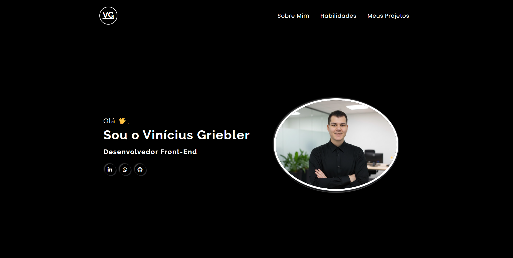

# 🌐 Portfólio Vinicius Griebler - Desenvolvedor Front-End

Bem-vindo(a) ao meu portfólio de **Desenvolvedor Front-End**!  
Este projeto reúne alguns dos meus principais trabalhos, demonstrando minhas habilidades em criação de interfaces modernas, responsivas e focadas na experiência do usuário.

---

## 🧑‍💻 Sobre mim

Olá! Eu sou um(a) desenvolvedor(a) Front-End apaixonado(a) por tecnologia e design.  
Tenho interesse em criar aplicações web eficientes, acessíveis e visualmente agradáveis, sempre buscando aprender novas ferramentas e boas práticas.

---

## 🚀 Tecnologias Utilizadas

Este portfólio foi desenvolvido utilizando:

- **HTML5**
- **CSS3**
- **JavaScript**
- **Git & GitHub**
